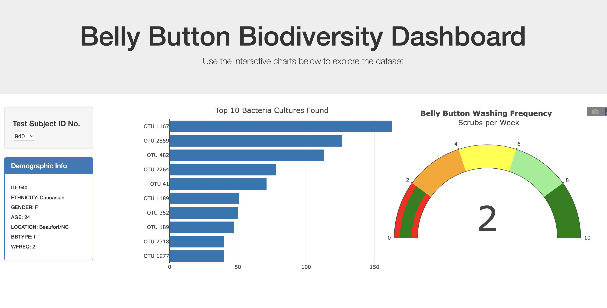
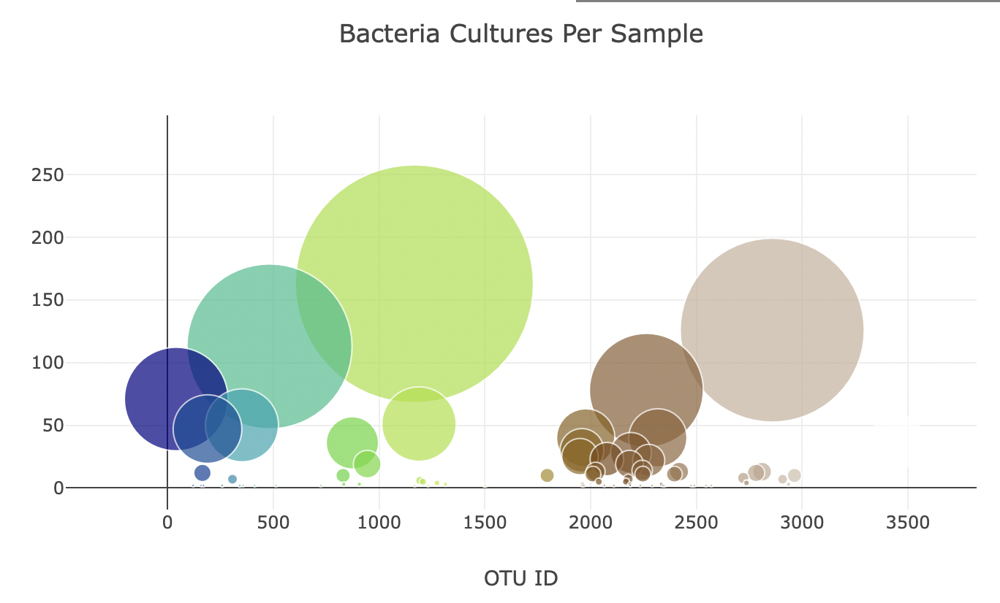

# PLOTLY Belly Button
You can use the [Link to Github.io](https://jonahrahn.github.io/plotly_Belly_Button/) to navigate and preview the content from the interactive dashboard to display the anonymous research data.

## Resources
- static/js/plot.js
- static/js/charts.js
- index.html
- samples.json
--------------
- Javascript
- VS Code
- CSS
- HTMl
- D3.js
- Plotly

## Overview of Project:
In the samples.json file, the data we are using consists of the amount of bacteria in the belly buttons of a group of participants. The goal is to display all of their data on an interactive dashboard where they can see their results. The first steps in buiding this project was the ability to create basic types of charts with Plotly, then we can use D3.json() to fetch external data, such as CSV files and web APIs. Once we have the data in JSON format we can then move the tools in Javascript to manipulate the data to streamline the interactivity of the data visualization. Once the dashboard has been tested, I can deploy the webpage to Github Pages where it can be used to sift through data.

## Results:
The process to filter the table includes selecting the id number of the participant, which will update and plot the new participants charts.

- Here we see the Landing page with the title of the project and then from left to right the participant selector, Rankings of bacteria amounts, and the washing frequency of the participants.

- Displayed in the plot above is the final graph of the project, which shows the culture size of each bacteria per sample.

## Summary:
The goal was to create the interactive dashboard to display the data and while this was helpful, there could have been more added to the project to enhance the idea. An addition that would bring value would be to create interactive selectors for the bacteria, which could display the average washing frequency for each culture. Another addition would be to show the washing frequency that equates to the cleanest sample.
